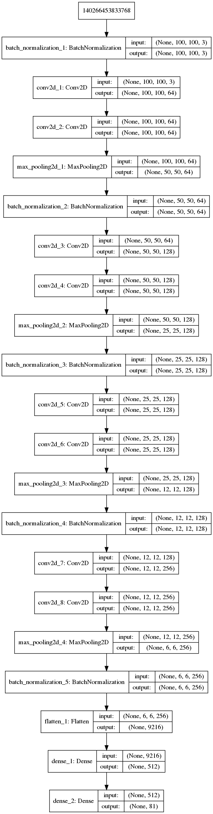

# __Convolutional Neural Network to identify fruits__

### __Dataset used__: 

[Fruits-360](https://www.kaggle.com/moltean/fruits/home) by Horea Muresan, Mihai Oltean 

The training data has 41322 labelled images and test data has 13877 labelled images. There are 81 classes of fruits present. The images are RGB type and 100x100 in size. I split the given test data into validation and test set.

### __Model Details__:

The team that created this dataset published a paper for their trained model. This isn't a implementation of their paper. My layer and filter(kernel) shapes are more inspired by the popular VGG-16 model. 

The convolutional layers have "same" padding mode, 5x5 filters, a stride of 1 and ReLU activations. Batch Normalization has been used for the inputs initially and then after every max-pooling layer. The max-pooling layers have a filter size of 2x2 and stride of 2. There is one fully-connected layer with 512 units and then the softmax output layer with 81 units(classes). 

I haven't used regularization in my model because I was experimenting and was not sure if my model will fit even the training data well. Also, each epoch takes more than 30 minutes on my Nvidia GT-940M. Tuning another hyper-parameter would have required a lot of time.

### __Model architecture__:

### __Goal__:
To build a CNN based classifier that fits the training set well and performs almost equally well on the validation & test set.
 
### __What's missing__:
 - Data augmentation techniques can be tried to create a better fit to the training data.
 - Regularization can be added to prevent overfitting so that our model can generalize better on unseen data.
 - Model architecture can be improved to increase the number of parameters
